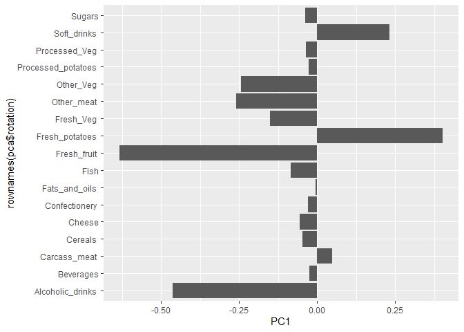

# Class 7: Machine Learning 1
Jeremy Pham (A16830268)

- [Clustering](#clustering)
  - [K-means](#k-means)
  - [Hierachial Clustering](#hierachial-clustering)
- [Principal Component Analysis
  (PCA)](#principal-component-analysis-pca)
  - [Data import](#data-import)
  - [PCA to the rescue](#pca-to-the-rescue)
  - [Interpreting PCA results](#interpreting-pca-results)

Today we will explore unsupervised machine learning methods starting
with clustering and dimenionality reduction.

## Clustering

To start, let’s make up some data to cluster where we know what the
answer should be. The `rnorm()` function will help us here.

``` r
hist(rnorm(10000, mean=3))
```


Return 30 numbers centered on -3

``` r
tmp <- c( rnorm(30, mean=-3),
  rnorm(30, mean=3) )

x <- cbind(x=tmp, y=rev(tmp))

x
```

                  x         y
     [1,] -1.824478  2.460851
     [2,] -3.899142  4.355900
     [3,] -1.916383  4.926428
     [4,] -2.580224  1.870159
     [5,] -2.890850  3.455625
     [6,] -1.899304  3.828701
     [7,] -5.117486  3.649862
     [8,] -1.786705  4.124031
     [9,] -3.829216  2.559091
    [10,] -2.717559  3.753558
    [11,] -5.631326  2.953763
    [12,] -1.915680  3.685842
    [13,] -3.180809  3.180443
    [14,] -2.096208  2.299992
    [15,] -2.077486  2.443096
    [16,] -2.817478  3.533228
    [17,] -4.754291  2.758699
    [18,] -2.518387  3.048939
    [19,] -3.578917  1.687348
    [20,] -2.905903  2.727107
    [21,] -3.522428  2.681940
    [22,] -3.246697  4.598319
    [23,] -2.323172  2.593050
    [24,] -2.910766  1.966002
    [25,] -3.454950  5.114794
    [26,] -3.796045  1.886617
    [27,] -4.482551  3.643200
    [28,] -2.736018  3.146527
    [29,] -2.725265  3.805089
    [30,] -2.314941  4.533315
    [31,]  4.533315 -2.314941
    [32,]  3.805089 -2.725265
    [33,]  3.146527 -2.736018
    [34,]  3.643200 -4.482551
    [35,]  1.886617 -3.796045
    [36,]  5.114794 -3.454950
    [37,]  1.966002 -2.910766
    [38,]  2.593050 -2.323172
    [39,]  4.598319 -3.246697
    [40,]  2.681940 -3.522428
    [41,]  2.727107 -2.905903
    [42,]  1.687348 -3.578917
    [43,]  3.048939 -2.518387
    [44,]  2.758699 -4.754291
    [45,]  3.533228 -2.817478
    [46,]  2.443096 -2.077486
    [47,]  2.299992 -2.096208
    [48,]  3.180443 -3.180809
    [49,]  3.685842 -1.915680
    [50,]  2.953763 -5.631326
    [51,]  3.753558 -2.717559
    [52,]  2.559091 -3.829216
    [53,]  4.124031 -1.786705
    [54,]  3.649862 -5.117486
    [55,]  3.828701 -1.899304
    [56,]  3.455625 -2.890850
    [57,]  1.870159 -2.580224
    [58,]  4.926428 -1.916383
    [59,]  4.355900 -3.899142
    [60,]  2.460851 -1.824478

Make a plot of `x`

``` r
plot(x)
```


### K-means

The main function in “base” R for K-means clustering is called
`kmeans()`

``` r
km <- kmeans(x, centers = 2)
km
```

    K-means clustering with 2 clusters of sizes 30, 30

    Cluster means:
              x         y
    1 -3.048356  3.242384
    2  3.242384 -3.048356

    Clustering vector:
     [1] 1 1 1 1 1 1 1 1 1 1 1 1 1 1 1 1 1 1 1 1 1 1 1 1 1 1 1 1 1 1 2 2 2 2 2 2 2 2
    [39] 2 2 2 2 2 2 2 2 2 2 2 2 2 2 2 2 2 2 2 2 2 2

    Within cluster sum of squares by cluster:
    [1] 54.53849 54.53849
     (between_SS / total_SS =  91.6 %)

    Available components:

    [1] "cluster"      "centers"      "totss"        "withinss"     "tot.withinss"
    [6] "betweenss"    "size"         "iter"         "ifault"      

The `kmeans()` function returns a “list” with 9 components. You can see
the named components of any list with the `attributes()` function.

``` r
attributes(km)
```

    $names
    [1] "cluster"      "centers"      "totss"        "withinss"     "tot.withinss"
    [6] "betweenss"    "size"         "iter"         "ifault"      

    $class
    [1] "kmeans"

> Question: How many points are in each cluster?

``` r
km$size
```

    [1] 30 30

> Question: Cluster assignment/membership vector?

``` r
km$cluster
```

     [1] 1 1 1 1 1 1 1 1 1 1 1 1 1 1 1 1 1 1 1 1 1 1 1 1 1 1 1 1 1 1 2 2 2 2 2 2 2 2
    [39] 2 2 2 2 2 2 2 2 2 2 2 2 2 2 2 2 2 2 2 2 2 2

> Question: Cluster centers?

``` r
km$centers
```

              x         y
    1 -3.048356  3.242384
    2  3.242384 -3.048356

> Question: Make a plot of our `kmeans()` results showing cluster
> assingment and using different colors for each cluster/group of points
> and cluster centers in blue.

``` r
plot(x, col=km$cluster)
points(km$centers, col="blue", pch=15, cex=2)
```


Adding in the point() function lets us add an extra point from the
pre-existing data

> Question: Run `kmeans()` again on `x` and this cluster into 4
> groups/clusters and plot the same result figure as above

``` r
kmx <- kmeans(x, centers=4)
kmx
```

    K-means clustering with 4 clusters of sizes 12, 30, 4, 14

    Cluster means:
              x         y
    1 -2.632080  4.142902
    2  3.242384 -3.048356
    3 -4.996414  3.251381
    4 -2.848576  2.467940

    Clustering vector:
     [1] 4 1 1 4 1 1 3 1 4 1 3 1 4 4 4 1 3 4 4 4 4 1 4 4 1 4 3 4 1 1 2 2 2 2 2 2 2 2
    [39] 2 2 2 2 2 2 2 2 2 2 2 2 2 2 2 2 2 2 2 2 2 2

    Within cluster sum of squares by cluster:
    [1]  8.536709 54.538486  1.384073  8.671575
     (between_SS / total_SS =  94.4 %)

    Available components:

    [1] "cluster"      "centers"      "totss"        "withinss"     "tot.withinss"
    [6] "betweenss"    "size"         "iter"         "ifault"      

``` r
plot(x, col=kmx$cluster)
points(kmx$centers, col="blue", pch=15, cex=2)
```


> **key-point**: K-means clustering is super popular but can be
> miss-used. One big limitation is that it can impose a clustering
> pattern on your data even if clear natural grouping doesn’t exist -
> i.e. it does what you it to do in terms of `centers`.

### Hierachial Clustering

The main function in “base” R for Hierarchical Clustering is called
`hclust()`.

You can’t just pass our dataset as is into `hclust()`. You mist give
“distance matrix” as input. We can get this from the `dist()` function
in R.

``` r
d <- dist(x)
hc <- hclust(d)
hc
```


    Call:
    hclust(d = d)

    Cluster method   : complete 
    Distance         : euclidean 
    Number of objects: 60 

The results of `hclust()` don’t have a useful `print()` method but do
have a special `plot()` method.

``` r
plot(hc)
abline(h=8, col="red")
```


To get our main cluster assignment (membership vector) we need to “cut”
the tree at the big “goal posts”…

``` r
grps <- cutree(hc, h=8)
grps
```

     [1] 1 1 1 1 1 1 1 1 1 1 1 1 1 1 1 1 1 1 1 1 1 1 1 1 1 1 1 1 1 1 2 2 2 2 2 2 2 2
    [39] 2 2 2 2 2 2 2 2 2 2 2 2 2 2 2 2 2 2 2 2 2 2

``` r
table(grps)
```

    grps
     1  2 
    30 30 

``` r
plot(x, col=grps)
```


Hierarchical Clustering is distinct in that the dendrogram (tree figure)
can reveal the potential grouping in your data (unlike K-means)

## Principal Component Analysis (PCA)

PCA is a common and highly useful dimensionality reduction technique
used in many fields - particularly bioinformatics.

Here we will analyze some data from the UK on food consumption.

### Data import

``` r
url <- "https://tinyurl.com/UK-foods"
x <- read.csv(url)

head(x)
```

                   X England Wales Scotland N.Ireland
    1         Cheese     105   103      103        66
    2  Carcass_meat      245   227      242       267
    3    Other_meat      685   803      750       586
    4           Fish     147   160      122        93
    5 Fats_and_oils      193   235      184       209
    6         Sugars     156   175      147       139

``` r
x <- read.csv(url, row.names = 1)
head(x)
```

                   England Wales Scotland N.Ireland
    Cheese             105   103      103        66
    Carcass_meat       245   227      242       267
    Other_meat         685   803      750       586
    Fish               147   160      122        93
    Fats_and_oils      193   235      184       209
    Sugars             156   175      147       139

``` r
barplot(as.matrix(x), beside=T, col=rainbow(nrow(x)))
```


``` r
barplot(as.matrix(x), beside=F, col=rainbow(nrow(x)))
```


By changing `beside=T` to `beside=F` we get this stacked plot. This plot
sucks.

One conventional plot that can be useful is called a “paris” plot.

``` r
pairs(x, col=rainbow(10), pch=16)
```


### PCA to the rescue

The main function in base R for PCA is called `prcomp()`.

``` r
pca <- prcomp(t(x)) # `t()` switches the rows to columns! x axis = y axis now
summary(pca)
```

    Importance of components:
                                PC1      PC2      PC3       PC4
    Standard deviation     324.1502 212.7478 73.87622 3.176e-14
    Proportion of Variance   0.6744   0.2905  0.03503 0.000e+00
    Cumulative Proportion    0.6744   0.9650  1.00000 1.000e+00

### Interpreting PCA results

The `prcomp()` function returns a list object of our results with five
attributes/components

``` r
attributes(pca)
```

    $names
    [1] "sdev"     "rotation" "center"   "scale"    "x"       

    $class
    [1] "prcomp"

The two main “results” in here are `pca$x` and `pca$rotation`. The first
of these (`pca$x`) contains the scores of the data on the new PC axis -
we use these to make our “PCA plot”.

``` r
pca$x
```

                     PC1         PC2        PC3           PC4
    England   -144.99315   -2.532999 105.768945 -4.894696e-14
    Wales     -240.52915 -224.646925 -56.475555  5.700024e-13
    Scotland   -91.86934  286.081786 -44.415495 -7.460785e-13
    N.Ireland  477.39164  -58.901862  -4.877895  2.321303e-13

``` r
library(ggplot2)
library(ggrepel)
```

    Warning: package 'ggrepel' was built under R version 4.3.3

``` r
# Make a plot of pca$x with PC1 vs PC2

ggplot(pca$x) + 
  aes(PC1, PC2, label=rownames(pca$x)) +
  geom_point() +
  geom_text_repel()
```


The second major result is contained in the `pca$rotation` object or
component. Let’s plot this to see what PCA is picking up…

``` r
ggplot(pca$rotation) + 
  aes(PC1, rownames(pca$rotation)) +
  geom_col()
```



Any column that is positive is consuming more than N. Ireland or is more
“like” N. Ireland. Any column that is negative is more “like” the other
countries.
