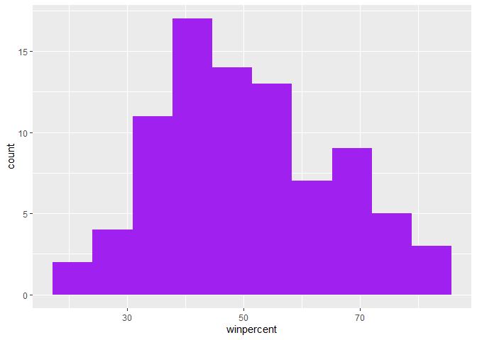
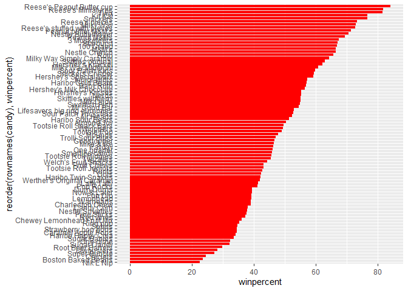
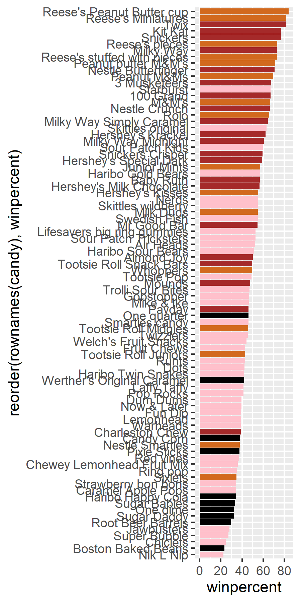
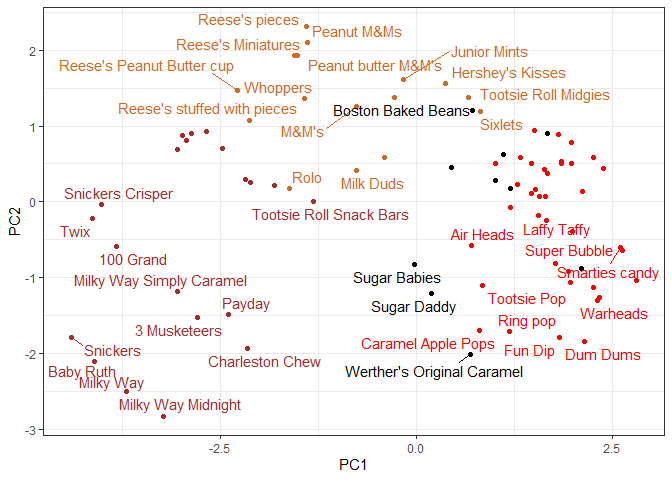
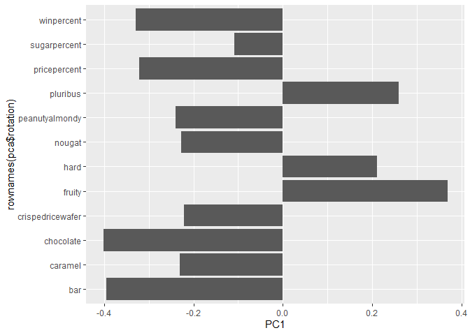
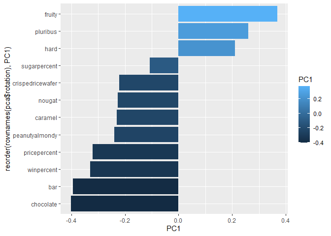

# Class 9: Halloween Candy Mini-Project
Jeremy Pham (A16830268)

- [Data Import](#data-import)
- [What is your favorite candy?](#what-is-your-favorite-candy)
- [Exploratory Analysis](#exploratory-analysis)
- [Overall Candy Rankings](#overall-candy-rankings)
- [Taking a look at pricepercent](#taking-a-look-at-pricepercent)
- [Exploring the Correlation
  Structure](#exploring-the-correlation-structure)
- [Principal Component Analysis
  (PCA)](#principal-component-analysis-pca)

Today we will take a small step back to some data we can taste and
explore the correlation structure and principal components of some
Halloween candy.

## Data Import

``` r
candy_file <- "candy-data.txt"

candy = read.csv(candy_file, row.names=1)
head(candy)
```

                 chocolate fruity caramel peanutyalmondy nougat crispedricewafer
    100 Grand            1      0       1              0      0                1
    3 Musketeers         1      0       0              0      1                0
    One dime             0      0       0              0      0                0
    One quarter          0      0       0              0      0                0
    Air Heads            0      1       0              0      0                0
    Almond Joy           1      0       0              1      0                0
                 hard bar pluribus sugarpercent pricepercent winpercent
    100 Grand       0   1        0        0.732        0.860   66.97173
    3 Musketeers    0   1        0        0.604        0.511   67.60294
    One dime        0   0        0        0.011        0.116   32.26109
    One quarter     0   0        0        0.011        0.511   46.11650
    Air Heads       0   0        0        0.906        0.511   52.34146
    Almond Joy      0   1        0        0.465        0.767   50.34755

> Question 1: How many different candy types are in this dataset?

``` r
dim(candy)
```

    [1] 85 12

``` r
nrow(candy)
```

    [1] 85

There are 12 different candy types in this dataset.

> Question 2: How many fruity candy types are in the dataset?

``` r
table(sum(candy$fruity == 1))
```


    38 
     1 

## What is your favorite candy?

> Question 3: What is your favorite candy in the dataset and what is
> it’s winpercent value?

``` r
candy["Starburst",]$winpercent
```

    [1] 67.03763

> Question 4: What is the winpercent value for “Kitkat”

``` r
candy["Kit Kat",]$winpercent
```

    [1] 76.7686

> Question 5: What is the winpercent value for “Tootsie Roll Snack
> Bars”?

``` r
candy["Tootsie Roll Snack Bars",]$winpercent
```

    [1] 49.6535

## Exploratory Analysis

We can use the **skimr** package to get a quick overview of a given
dataset. This can be useful for the first time you encounter a new
dataset.

``` r
skimr::skim(candy)
```

|                                                  |       |
|:-------------------------------------------------|:------|
| Name                                             | candy |
| Number of rows                                   | 85    |
| Number of columns                                | 12    |
| \_\_\_\_\_\_\_\_\_\_\_\_\_\_\_\_\_\_\_\_\_\_\_   |       |
| Column type frequency:                           |       |
| numeric                                          | 12    |
| \_\_\_\_\_\_\_\_\_\_\_\_\_\_\_\_\_\_\_\_\_\_\_\_ |       |
| Group variables                                  | None  |

Data summary

**Variable type: numeric**

| skim_variable | n_missing | complete_rate | mean | sd | p0 | p25 | p50 | p75 | p100 | hist |
|:---|---:|---:|---:|---:|---:|---:|---:|---:|---:|:---|
| chocolate | 0 | 1 | 0.44 | 0.50 | 0.00 | 0.00 | 0.00 | 1.00 | 1.00 | ▇▁▁▁▆ |
| fruity | 0 | 1 | 0.45 | 0.50 | 0.00 | 0.00 | 0.00 | 1.00 | 1.00 | ▇▁▁▁▆ |
| caramel | 0 | 1 | 0.16 | 0.37 | 0.00 | 0.00 | 0.00 | 0.00 | 1.00 | ▇▁▁▁▂ |
| peanutyalmondy | 0 | 1 | 0.16 | 0.37 | 0.00 | 0.00 | 0.00 | 0.00 | 1.00 | ▇▁▁▁▂ |
| nougat | 0 | 1 | 0.08 | 0.28 | 0.00 | 0.00 | 0.00 | 0.00 | 1.00 | ▇▁▁▁▁ |
| crispedricewafer | 0 | 1 | 0.08 | 0.28 | 0.00 | 0.00 | 0.00 | 0.00 | 1.00 | ▇▁▁▁▁ |
| hard | 0 | 1 | 0.18 | 0.38 | 0.00 | 0.00 | 0.00 | 0.00 | 1.00 | ▇▁▁▁▂ |
| bar | 0 | 1 | 0.25 | 0.43 | 0.00 | 0.00 | 0.00 | 0.00 | 1.00 | ▇▁▁▁▂ |
| pluribus | 0 | 1 | 0.52 | 0.50 | 0.00 | 0.00 | 1.00 | 1.00 | 1.00 | ▇▁▁▁▇ |
| sugarpercent | 0 | 1 | 0.48 | 0.28 | 0.01 | 0.22 | 0.47 | 0.73 | 0.99 | ▇▇▇▇▆ |
| pricepercent | 0 | 1 | 0.47 | 0.29 | 0.01 | 0.26 | 0.47 | 0.65 | 0.98 | ▇▇▇▇▆ |
| winpercent | 0 | 1 | 50.32 | 14.71 | 22.45 | 39.14 | 47.83 | 59.86 | 84.18 | ▃▇▆▅▂ |

``` r
# the '::' tells R to go into the package to look for the function isntead of pulling up the whole thing as we do with 'libary()'
```

> Question 6: Is there any variable/column that looks to be on a
> different scale to the majority of the other columns in the dataset?

It looks like the last column `candy$winpercent` is on a different scale
to all others.

> Question 7: What do you think a zero and one represent for the
> candy\$chocolate column?

> Question 8. Plot a histogram of winpercent values

``` r
hist(candy$winpercent,)
```


``` r
library (ggplot2)

ggplot(candy) +
  aes(winpercent) +
  geom_histogram(bins=10, fill = "purple")
```



> Question 9. Is the distribution of winpercent values symmetrical?

No

> Question 10. Is the center of the distribution above or below 50%?

``` r
summary(candy$winpercent)
```

       Min. 1st Qu.  Median    Mean 3rd Qu.    Max. 
      22.45   39.14   47.83   50.32   59.86   84.18 

The median (center of the distribution) is below 50%

> Question 11. On average is chocolate candy higher or lower ranked than
> fruit candy?

``` r
choc.inds <- candy$chocolate == 1
choc.candy <- candy[choc.inds,]
choc.win <- choc.candy$winpercent
mean(choc.win)
```

    [1] 60.92153

``` r
fruity.inds <- candy$fruity == 1
fruity.candy <- candy[fruity.inds,]
fruity.win <- fruity.candy$winpercent
mean(fruity.win)
```

    [1] 44.11974

On average, chocolate candy is ranked higher than fruity candy

``` r
fruit.win <- candy[ as.logical(candy$fruity),]$winpercent
#another way of writing the above code chunk, it does the same thing but is just more compressed
```

> Q12. Is this difference statistically significant?

``` r
#t.test()

ans <- t.test(choc.win, fruity.win)
ans
```


        Welch Two Sample t-test

    data:  choc.win and fruity.win
    t = 6.2582, df = 68.882, p-value = 2.871e-08
    alternative hypothesis: true difference in means is not equal to 0
    95 percent confidence interval:
     11.44563 22.15795
    sample estimates:
    mean of x mean of y 
     60.92153  44.11974 

Looking at the p-value of 2.8713778^{-8}, we can say that yes, this
difference IS statistically significant!

``` r
ans$p.value
```

    [1] 2.871378e-08

## Overall Candy Rankings

> Question What are the five least liked candy types in this set?

There are two related functions that can help here, one is the classic
`sort()` and `order()`

``` r
x <- c(5,10,1,4)
sort(x)
```

    [1]  1  4  5 10

``` r
order(x)
```

    [1] 3 4 1 2

``` r
inds <- order(candy$winpercent)
head(candy[inds,],5)
```

                       chocolate fruity caramel peanutyalmondy nougat
    Nik L Nip                  0      1       0              0      0
    Boston Baked Beans         0      0       0              1      0
    Chiclets                   0      1       0              0      0
    Super Bubble               0      1       0              0      0
    Jawbusters                 0      1       0              0      0
                       crispedricewafer hard bar pluribus sugarpercent pricepercent
    Nik L Nip                         0    0   0        1        0.197        0.976
    Boston Baked Beans                0    0   0        1        0.313        0.511
    Chiclets                          0    0   0        1        0.046        0.325
    Super Bubble                      0    0   0        0        0.162        0.116
    Jawbusters                        0    1   0        1        0.093        0.511
                       winpercent
    Nik L Nip            22.44534
    Boston Baked Beans   23.41782
    Chiclets             24.52499
    Super Bubble         27.30386
    Jawbusters           28.12744

> Question 14: WHat are the top 5 all time favorite candy types in this
> set?

``` r
tail(candy[inds,], 5)
```

                              chocolate fruity caramel peanutyalmondy nougat
    Snickers                          1      0       1              1      1
    Kit Kat                           1      0       0              0      0
    Twix                              1      0       1              0      0
    Reese's Miniatures                1      0       0              1      0
    Reese's Peanut Butter cup         1      0       0              1      0
                              crispedricewafer hard bar pluribus sugarpercent
    Snickers                                 0    0   1        0        0.546
    Kit Kat                                  1    0   1        0        0.313
    Twix                                     1    0   1        0        0.546
    Reese's Miniatures                       0    0   0        0        0.034
    Reese's Peanut Butter cup                0    0   0        0        0.720
                              pricepercent winpercent
    Snickers                         0.651   76.67378
    Kit Kat                          0.511   76.76860
    Twix                             0.906   81.64291
    Reese's Miniatures               0.279   81.86626
    Reese's Peanut Butter cup        0.651   84.18029

``` r
inds <- order(candy$winpercent, decreasing = T)
head(candy[inds,],5)
```

                              chocolate fruity caramel peanutyalmondy nougat
    Reese's Peanut Butter cup         1      0       0              1      0
    Reese's Miniatures                1      0       0              1      0
    Twix                              1      0       1              0      0
    Kit Kat                           1      0       0              0      0
    Snickers                          1      0       1              1      1
                              crispedricewafer hard bar pluribus sugarpercent
    Reese's Peanut Butter cup                0    0   0        0        0.720
    Reese's Miniatures                       0    0   0        0        0.034
    Twix                                     1    0   1        0        0.546
    Kit Kat                                  1    0   1        0        0.313
    Snickers                                 0    0   1        0        0.546
                              pricepercent winpercent
    Reese's Peanut Butter cup        0.651   84.18029
    Reese's Miniatures               0.279   81.86626
    Twix                             0.906   81.64291
    Kit Kat                          0.511   76.76860
    Snickers                         0.651   76.67378

> Question 15: Make a first barplot of candy ranking based on winpercent
> values

Make a bar plot with ggplot and order it by winpercent values

``` r
library(ggplot2)
ggplot(candy) +
  aes(winpercent, rownames(candy)) +
  geom_col()
```


> Question 16: Use the reorder() function

``` r
ggplot(candy) +
  aes(winpercent, reorder(rownames(candy), winpercent)) +
  geom_col()
```


``` r
ggplot(candy) +
  aes(winpercent, reorder(rownames(candy), winpercent)) +
  geom_col(fill="red")
```



``` r
ggplot(candy) +
  aes(x = winpercent,
      y = reorder(rownames(candy), winpercent),
      fill=chocolate) +
  geom_col()
```


Here we want a custom color vector to color each bar the way we want -
with `chocolate` and `fruity` candy together with whether it is a `bar`
or not

``` r
mycols <- rep("black", nrow(candy))
mycols[as.logical(candy$chocolate)] <- "chocolate"
mycols[as.logical(candy$fruity)] <- "pink"
mycols[as.logical(candy$bar)] <- "brown"
 

ggplot(candy) +
  aes(winpercent, reorder(rownames(candy), winpercent)) +
  geom_col(fill=mycols)
```


``` r
ggsave("mybarplot.png", width = 3, height = 6)
```



> Question: 17. What is the worst ranked chocolate candy?

Sixlets

> Question 18. What is the best ranked fruity candy?

## Taking a look at pricepercent

``` r
# Pink is too light
mycols[as.logical(candy$fruity)] <- "red"
library(ggrepel)
```

    Warning: package 'ggrepel' was built under R version 4.3.3

``` r
# How about a plot of price vs win
ggplot(candy) +
  aes(winpercent, pricepercent, label=rownames(candy)) +
  geom_point(col=mycols) + 
  geom_text_repel(col=mycols, size=3.3, max.overlaps = 8)
```

    Warning: ggrepel: 33 unlabeled data points (too many overlaps). Consider
    increasing max.overlaps


## Exploring the Correlation Structure

``` r
cij <- cor(candy)
cij
```

                      chocolate      fruity     caramel peanutyalmondy      nougat
    chocolate         1.0000000 -0.74172106  0.24987535     0.37782357  0.25489183
    fruity           -0.7417211  1.00000000 -0.33548538    -0.39928014 -0.26936712
    caramel           0.2498753 -0.33548538  1.00000000     0.05935614  0.32849280
    peanutyalmondy    0.3778236 -0.39928014  0.05935614     1.00000000  0.21311310
    nougat            0.2548918 -0.26936712  0.32849280     0.21311310  1.00000000
    crispedricewafer  0.3412098 -0.26936712  0.21311310    -0.01764631 -0.08974359
    hard             -0.3441769  0.39067750 -0.12235513    -0.20555661 -0.13867505
    bar               0.5974211 -0.51506558  0.33396002     0.26041960  0.52297636
    pluribus         -0.3396752  0.29972522 -0.26958501    -0.20610932 -0.31033884
    sugarpercent      0.1041691 -0.03439296  0.22193335     0.08788927  0.12308135
    pricepercent      0.5046754 -0.43096853  0.25432709     0.30915323  0.15319643
    winpercent        0.6365167 -0.38093814  0.21341630     0.40619220  0.19937530
                     crispedricewafer        hard         bar    pluribus
    chocolate              0.34120978 -0.34417691  0.59742114 -0.33967519
    fruity                -0.26936712  0.39067750 -0.51506558  0.29972522
    caramel                0.21311310 -0.12235513  0.33396002 -0.26958501
    peanutyalmondy        -0.01764631 -0.20555661  0.26041960 -0.20610932
    nougat                -0.08974359 -0.13867505  0.52297636 -0.31033884
    crispedricewafer       1.00000000 -0.13867505  0.42375093 -0.22469338
    hard                  -0.13867505  1.00000000 -0.26516504  0.01453172
    bar                    0.42375093 -0.26516504  1.00000000 -0.59340892
    pluribus              -0.22469338  0.01453172 -0.59340892  1.00000000
    sugarpercent           0.06994969  0.09180975  0.09998516  0.04552282
    pricepercent           0.32826539 -0.24436534  0.51840654 -0.22079363
    winpercent             0.32467965 -0.31038158  0.42992933 -0.24744787
                     sugarpercent pricepercent winpercent
    chocolate          0.10416906    0.5046754  0.6365167
    fruity            -0.03439296   -0.4309685 -0.3809381
    caramel            0.22193335    0.2543271  0.2134163
    peanutyalmondy     0.08788927    0.3091532  0.4061922
    nougat             0.12308135    0.1531964  0.1993753
    crispedricewafer   0.06994969    0.3282654  0.3246797
    hard               0.09180975   -0.2443653 -0.3103816
    bar                0.09998516    0.5184065  0.4299293
    pluribus           0.04552282   -0.2207936 -0.2474479
    sugarpercent       1.00000000    0.3297064  0.2291507
    pricepercent       0.32970639    1.0000000  0.3453254
    winpercent         0.22915066    0.3453254  1.0000000

``` r
library(corrplot)
```

    Warning: package 'corrplot' was built under R version 4.3.3

    corrplot 0.95 loaded

``` r
corrplot(cij)
```


> Question 22: Examining this plot what two variables are
> anto-correlated (have minus values)

Chocolate and fruity are negatively correlated

``` r
round( cij["chocolate", "fruity"], 2 )
```

    [1] -0.74

> Question 23: What two variables are most positively correlated?

Chocolate and bar

## Principal Component Analysis (PCA)

We need to be sure to scale our input `candy` data before PCA as we have
the `winpercent` column on a different scale to all others in the
dataset.

``` r
pca <- prcomp(candy, scale = T)
summary(pca)
```

    Importance of components:
                              PC1    PC2    PC3     PC4    PC5     PC6     PC7
    Standard deviation     2.0788 1.1378 1.1092 1.07533 0.9518 0.81923 0.81530
    Proportion of Variance 0.3601 0.1079 0.1025 0.09636 0.0755 0.05593 0.05539
    Cumulative Proportion  0.3601 0.4680 0.5705 0.66688 0.7424 0.79830 0.85369
                               PC8     PC9    PC10    PC11    PC12
    Standard deviation     0.74530 0.67824 0.62349 0.43974 0.39760
    Proportion of Variance 0.04629 0.03833 0.03239 0.01611 0.01317
    Cumulative Proportion  0.89998 0.93832 0.97071 0.98683 1.00000

First main result figure is my “PCA plot”

``` r
#pca$x
ggplot(pca$x) + 
  aes(PC1, PC2, label = rownames(pca$x)) +
  geom_point(col=mycols) +
  geom_text_repel(max.overlaps = 6, col=mycols) +
  theme_bw() 
```

    Warning: ggrepel: 45 unlabeled data points (too many overlaps). Consider
    increasing max.overlaps



The second main PCA result is in the `pca$rotation` we can plot this to
generate a so-called “loadings” plot.

``` r
#pca$rotation

ggplot(pca$rotation) +
  aes(PC1, rownames(pca$rotation)) +
  geom_col()
```



``` r
ggplot(pca$rotation) +
  aes(PC1, reorder(rownames(pca$rotation), PC1), fill = PC1) +
  geom_col()
```



> Question 24: What original variables are picked up strongly by PC1 in
> the positive direction? DO these make sense to you?

Fruity, pluribus, and hard.
